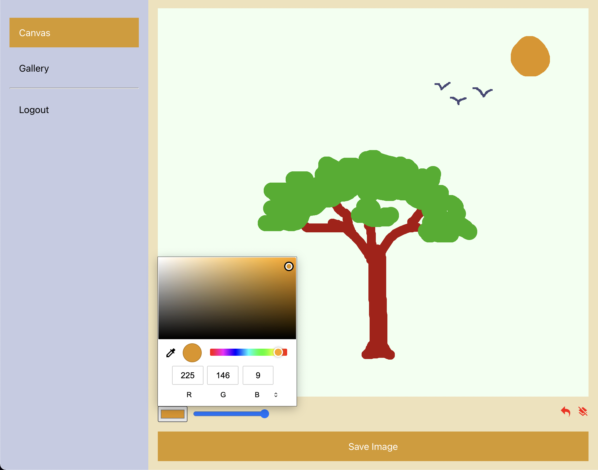
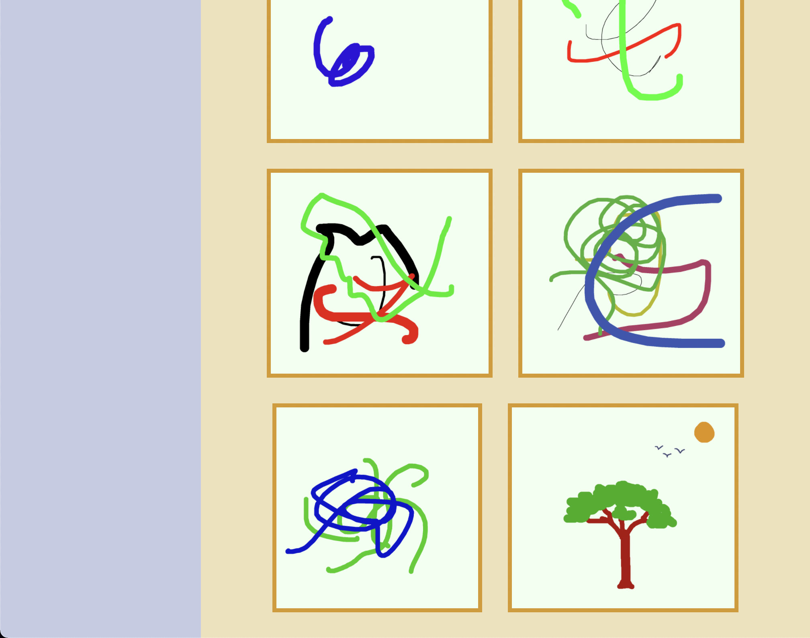

# Fresh Brush
Discover the artist within you!

Select a colorful brush and use natural motions to paint on the screen. Undo strokes which were less than perfect. Once you are done, save your painting to your Gallery. 

## Screenshots
### Welcome: Discover the artist within you

### Paint: Use natural motions to paint on the screen

### Gallery: Save your paintings to your Gallery

## Setup
1. git clone this repo to your system
1. setup a project in your firebase console, and register a web app.
1. enable email/password login in firebase authentication for your project in firebase console. 
1. setup firebase firestore and storage in the firebase console. 
1. copy the firebase config of your project into your local .env file (use the template in .env.example file)
1. npm install -g firebase-tools && firebase login if using firebase for the first time on your system.
1. npm run build to build the react app
1. provide your firebase project-name in .firebaserc (use the templete in .firebaserc.example file)
1. firebase deploy --only hosting to deploy the app to your firebase hosted domain. 

## Stack
This project was initialized with [Create React App](https://github.com/facebook/create-react-app).

Styling and layout was done with [node-sass](https://github.com/sass/node-sass).

[Firebase](https://firebase.google.com/) was used for storing files/images, data/documents and for user authentication. 